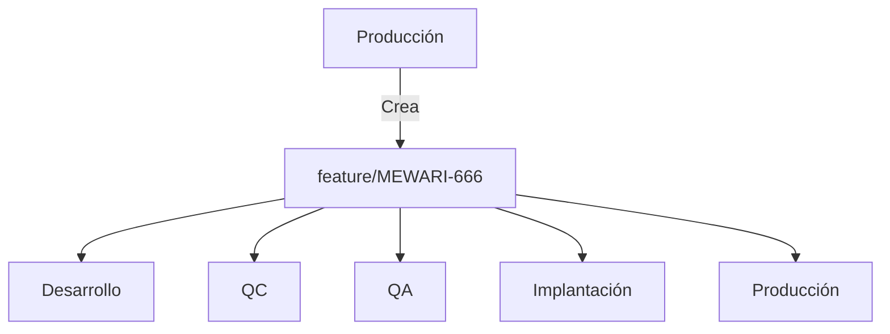

**Versión:** 1.0  
**Fecha:** 29/10/2025  

# 🧭 Plan de Acción – Promoción Controlada por Feature Branch

## 1. Objetivo
Establecer un procedimiento estandarizado y seguro para promover funcionalidades individuales (`feature/*`) entre los distintos ambientes (`desarrollo`, `qc`, `qa`, `implantacion`, `produccion`), evitando integraciones accidentales y garantizando trazabilidad, revisiones y control de aprobaciones.

---

## 2. Estado Actual
- Cada desarrollador crea su branch desde `produccion`.
- Las pruebas y promociones se hacen por ambiente.
- No existen merges entre ramas de ambiente.
- Se requiere poder pasar solo una funcionalidad sin mover el contenido de otras ramas en prueba.

---

## 3. Estrategia Seleccionada
**Promoción controlada por Feature Branch.**

Cada feature branch avanza de ambiente en ambiente mediante **Pull Requests (PR)**, con revisiones técnicas y funcionales, asegurando que solo se promueva el código del feature correspondiente.

---

## 4. Naming Estandarizado de Ramas
| Tipo | Formato | Ejemplo |
|------|----------|----------|
| Feature | `feature/<ticket>-<descripcion>` | `feature/MEWARI-666` |
| Bugfix | `bugfix/<ticket>-<descripcion>` | `bugfix/456-fix-timezone` |
| Hotfix | `hotfix/<ticket>-<descripcion>` | `hotfix/789-error-produccion` |

---

## 5. Reglas de Protección de Branches
En **GitHub**, habilitar las siguientes políticas para cada rama de ambiente (`desarrollo`, `qc`, `qa`, `implantacion`, `produccion`):

- ❌ No permitir *push directo*.
- ✅ Requerir **Pull Request (PR)** para merges.
- ✅ Requerir **aprobación de al menos un revisor técnico**.
- ✅ Requerir CI/CD exitoso antes del merge (opcional según políticas).

---

## 6. Procedimiento General

### 6.1 Creación del Branch de Feature
```bash
git checkout produccion
git pull origin produccion
git checkout -b feature/MEWARI-666
```

Desarrollar los cambios, realizar commits frecuentes:
```bash
git add .
git commit -m "MEWARI-666 Implementación del login de usuario (HU MEWARI-666)"
git push origin feature/MEWARI-666
```
🔹Indicando en el mensaje del Commit el HU relacionada

Verificar diferencias cpon produccion (Resumen):
``` bash
git status
git fetch origin
git rev-list --left-right --count origin/produccion...HEAD
```
🔹 Resultado 1 = commits que están en produccion y no en tu branch (te faltan homologar).

🔸 Resutlado 2 = commits que tienes en tu branch y no están en produccion.

Verificar diferencias con producción (Detallado):
```bash
git diff produccion...feature/MEWARI-666 --stat
git log --oneline --graph --decorate
```


Homologacion con produccion
```bash
git pull origin produccion --no-ff --no-commit
git status
git add .
git commit -m "MEWARI-666 Homologacion con Producción"
git push origin MEWARI-666
```

---

### 6.2 Promoción entre Ambientes

#### 🔹 Paso 1: Integrar en Desarrollo
1. Homologa a la ultima version de produccion
1. Desarrollador debe crear un PR:
   - **Origen:** `feature/MEWARI-666`
   - **Destino:** `desarrollo`
2. Validación de pruebas unitarias.
3. Merge por integrador (No requiere aprobación):
   ```bash
   git checkout desarrollo
   git pull origin desarrollo
   git merge --no-ff origin/feature/MEWARI-666
   git push origin desarrollo
   ```

---

#### 🔹 Paso 2: Promover a QC
1. Homologa a la ultima version de produccion
1. Desarrollador debe crear PR:
   - **Origen:** `feature/MEWARI-666`
   - **Destino:** `qc`
2. Revision tecnica/funcional entre Desarrollador y Lider tecnico
3. Merge por integrador (Requiere aprobación del Lider tecnico):
   ```bash
   git checkout qc
   git pull origin qc
   git merge --no-ff origin/feature/MEWARI-666
   git push origin qc
   ```

---

#### 🔹 Paso 3: Promover a QA
1. Homologa a la ultima version de produccion
2. Desarrollador debe crear PR:
   - **Origen:** `feature/MEWARI-666`
   - **Destino:** `qa`
2. Validación de pruebas funcionales (Evidencia) entregadas por el Desarrollador.
2. Integrador restringe el permiso de escritura del Desarrollador al Branch `feature/MEWARI-666`
3. Merge por integrador (Requiere aprobación):
   ```bash
   git checkout qa
   git pull origin qa
   git merge --no-ff origin/feature/MEWARI-666
   git push origin qa
   ```

---

#### 🔹 Paso 4: Promover a Implantación
1. Homologa a la ultima version de produccion (Informa conflictos)
2. Integrador debe crear PR:
   - **Origen:** `feature/MEWARI-666`
   - **Destino:** `implantacion`
2. Requiere de aprobacion en certificacion
3. Validacion de pase a produccion de Operaciones (DPC, Scripts) y aprobacion.
3. Merge (Requiere aprobación de Operaciones):
   ```bash
   git checkout implantacion
   git pull origin implantacion
   git merge --no-ff origin/feature/MEWARI-666
   git push origin implantacion
   ```

---

#### 🔹 Paso 5: Promover a Producción
1. Operaciones debe crear PR final:
   - **Origen:** `feature/MEWARI-666`
   - **Destino:** `produccion`
3. Merge final:
   ```bash
   git checkout produccion
   git pull origin produccion
   git merge --no-ff origin/feature/MEWARI-666
   git push origin produccion
   ```

---

## 7. Checklist de Control
Antes de aprobar un PR:
| Ítem | Descripción | Responsable |
|------|--------------|-------------|
| ✅ Código revisado | Cambios diferentes de la rama de produccion. | Desarrollador |
| ✅ Pruebas unitarias | Todas las pruebas deben tener evidencia en desarrollo. | Desarrollador |
| ✅ Código revisado | Al menos un revisor Lider tecnico ha aprobado el PR hacia QC | Revisor Lider tecnico |
| ✅ Validación funcional | La funcionalidad cumple los criterios definidos segun el alcance establecido. | Testing |
| ✅ Issue vinculado | El PR referencia la historia de usuario y solicita la promocion a QC, QA o Implantacion a traves del Jira | Desarrollador |

---

## 8. Trazabilidad y Auditoría
Registrar en el PR:
```
| HU |
|--------| 
| ID JIRA HU |

## Pasos para la ejecución
1. Ejecutar scripts preliminar
``` sql
  /* Aqui los scripts preliminares que no sean parte del documento de pase */
  ```
2. Ejecutar scripts del branch
- *Archivo .sql a ejecutar*
- *Archivo .sql a ejecutar*
- *Archivo .sql a ejecutar*
3. Ejecutar scripts posteriores
``` sql
  /* Aqui los scripts psoteriores que no sean parte del documento de pase */
  ```
4. Ejecutar paso 3 del DPC *para instalar libreria en artifactory*
5. Ejecutar paso 4 del DPC *para importar el LDIF*
6. *Cualquier otra instruccion que se requiera para el despliegue*
7. Homologar y desplegar
```

Crear etiqueta al llegar a producción:
```bash
git tag -a v2025.11.05-JIRA123 -m "Feature login de usuario (MEWARI-666)"
git push origin v2025.11.05-JIRA123
```

---

## 9. Roles y Responsabilidades
| Rol | Responsabilidad |
|------|------------------|
| **Desarrollador** | Crea branch desde `produccion`, desarrolla, prueba y solicita PR. |
| **Integrador** | Valida dpc, código y scripts bajo lineamientos explicitos, aprueba PR. |
| **Lider técnico** | Valida código, convenciones, aprueba PR. |
| **Tester** | Ejecuta pruebas funcionales y de regresión por ambiente. |
| **Operaciones** | Autoriza paso a producción. |

---

## 10. Beneficios Esperados
| Beneficio | Descripción |
|------------|--------------|
| 🎯 Control por funcionalidad | Solo pasa el código necesario. |
| 🧩 Flexibilidad | Permite flujos paralelos. |
| 🔒 Seguridad | Revisión obligatoria antes del merge. |
| 🕵️‍♂️ Trazabilidad | Historial completo por PR y ticket. |
| ⚡ Rapidez | Promoción independiente de otros desarrollos. |

---

## 11. Flujo Visual


Cada paso implica un PR con revisión, pruebas (Evidencia) y aprobación.

---

## 12. Mantenimiento y Seguimiento
- Revisar mensualmente:
  - Cumplimiento de revisiones técnicas.
  - Número de merges corregidos.
- Ajustar el proceso según métricas y retroalimentación del equipo.

---
